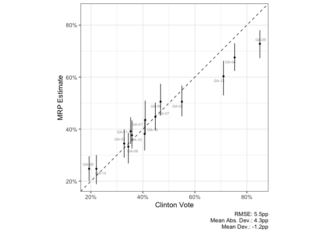

<!-- README.md is generated from README.Rmd. Please edit that file -->

# ccesMRPviz

<!-- badges: start -->
<!-- badges: end -->

The goal of ccesMRPviz is to visualize and diagnose common tasks in MRP
and survey analysis. It was formerly a part of the
[ccesMRPrun](https://github.com/kuriwaki/ccesMRPrun) package.

``` r
library(dplyr)
#> 
#> Attaching package: 'dplyr'
#> The following objects are masked from 'package:stats':
#> 
#>     filter, lag
#> The following objects are masked from 'package:base':
#> 
#>     intersect, setdiff, setequal, union
library(ccesMRPrun)
library(ccesMRPviz)
```

``` r
# MRP sims setup
mrp_df <- summ_sims(poststrat_draws(fit_GA, poststrat_tgt = acs_GA)) %>%
  left_join(elec_GA)
#> Joining, by = "cd"


mrp_df
#> # A tibble: 14 × 9
#>    cd    p_mrp_est p_mrp_se p_mrp_050 p_mrp_100 p_mrp_900 p_mrp_950 clinton_vote
#>    <chr>     <dbl>    <dbl>     <dbl>     <dbl>     <dbl>     <dbl>        <dbl>
#>  1 GA-01     0.435   0.0398     0.379     0.390     0.488     0.510        0.409
#>  2 GA-02     0.505   0.0361     0.449     0.462     0.552     0.567        0.55 
#>  3 GA-03     0.345   0.0327     0.290     0.304     0.386     0.398        0.328
#>  4 GA-04     0.675   0.0320     0.624     0.635     0.717     0.730        0.753
#>  5 GA-05     0.728   0.0327     0.673     0.685     0.769     0.780        0.85 
#>  6 GA-06     0.506   0.0373     0.452     0.463     0.556     0.574        0.468
#>  7 GA-07     0.447   0.0318     0.396     0.408     0.488     0.502        0.448
#>  8 GA-08     0.333   0.0365     0.268     0.284     0.376     0.386        0.344
#>  9 GA-09     0.248   0.0291     0.200     0.211     0.284     0.295        0.193
#> 10 GA-10     0.376   0.0332     0.326     0.336     0.418     0.434        0.358
#> 11 GA-11     0.392   0.0313     0.343     0.354     0.433     0.446        0.353
#> 12 GA-12     0.382   0.0366     0.318     0.333     0.424     0.439        0.407
#> 13 GA-13     0.603   0.0410     0.530     0.549     0.652     0.663        0.71 
#> 14 GA-14     0.247   0.0343     0.188     0.202     0.290     0.301        0.221
#> # … with 1 more variable: clinton_vote_2pty <dbl>
```

## scatter_45

Currently, the only function is `scatter_45`, which is a wrapper around
ggplot which enforces a visualization of a simple scatterplot that I
[argue](https://github.com/RohanAlexander/mrpbook) is important for
finding patterns in survey estimates relative to ground truth. These
graphs:

-   Enforce a 1:1 aspect ratio
-   Uses the same range for both axes

which makes the plot into a square.

In addition, this wrapper easily enables:

-   Computation and listing of summary stats (RMSE, Correlation, Mean
    Deviance)
-   Facetting scatterplots using `facet_wrap`
-   Adding confidence intervals
-   Coloring and labeling points.

``` r
scatter_45(mrp_df,
           clinton_vote,
           p_mrp_est,
           lblvar = cd,
           lbvar = p_mrp_050,
           ubvar = p_mrp_950,
           xlab = "Clinton Vote",
           ylab = "MRP Estimate")
```


